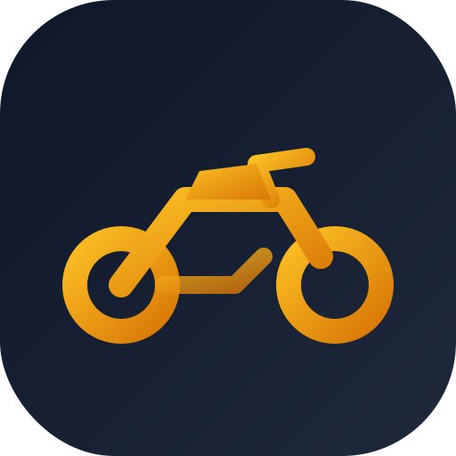

<<<<<<< HEAD
# 🚭 Snusfri Coach

En motiverende app som hjelper deg å holde deg snusfri med fokus på motorsykkelmål. Appen bruker AI for å generere personaliserte motivasjonsmeldinger basert på dine fremskritt.



## ✨ Funksjoner

- 📊 **Dashboard** med statistikk over snusfrie dager
- 💰 **Penge-kalkulator** som viser hvor mye du har spart
- 🏍️ **Motorsykkelmål** - visualiser drømmen din
- 🤖 **AI-generert motivasjon** tilpasset dine fremskritt
- 📱 **Responsiv design** som fungerer på alle enheter

## 🚀 Kom i gang

### Forutsetninger
- Node.js (versjon 16 eller nyere)
- En AI API-nøkkel (Google Gemini, OpenAI, etc.)

### Installasjon

1. **Klon repository:**
   ```bash
   git clone https://github.com/barx10/snusfri-coach.git
   cd snusfri-coach
   ```

2. **Installer dependencies:**
   ```bash
   npm install
   ```

3. **Sett opp miljøvariabler:**
   ```bash
   cp .env.example .env
   ```
   Rediger `.env` og legg til din API-nøkkel:
   ```
   API_KEY=din_api_nøkkel_her
   ```

4. **Sett opp AI service:**
   ```bash
   cp services/geminiService.template.ts services/geminiService.ts
   ```
   Rediger `services/geminiService.ts` og implementer din foretrukne AI-tjeneste.

5. **Start utviklingsserver:**
   ```bash
   npm run dev
   ```

6. **Åpne i nettleser:**
   Gå til `http://localhost:5173`

## 🛠️ API Oppsett

Denne appen bruker AI for å generere personaliserte motivasjonsmeldinger. Du kan velge mellom:

- **Google Gemini** (anbefalt)
- **OpenAI GPT**
- **Anthropic Claude**
- **Andre AI-tjenester**

Se `services/geminiService.template.ts` for implementeringsguide.

## 🏗️ Bygg for produksjon

```bash
npm run build
```

De byggede filene vil være i `dist/` mappen.

## 🤝 Bidra

Bidrag er velkomne! Her er hvordan du kan hjelpe:

1. Fork prosjektet
2. Opprett en feature branch (`git checkout -b feature/AmazingFeature`)
3. Commit endringene dine (`git commit -m 'Add some AmazingFeature'`)
4. Push til branchen (`git push origin feature/AmazingFeature`)
5. Åpne en Pull Request

## 📝 Lisens

Dette prosjektet er lisensiert under MIT License - se [LICENSE](LICENSE) filen for detaljer.

## 🙏 Takk til

- Alle som kjemper mot snusavhengighet
- Motorsykkel-communityet for inspirasjon
- Open source-bidragsyterne

## 📞 Support

Hvis du har spørsmål eller trenger hjelp, oprett en [issue](https://github.com/barx10/snusfri-coach/issues).

---

**Lykke til med reisen mot et snusfritt liv! 🏍️💪**
