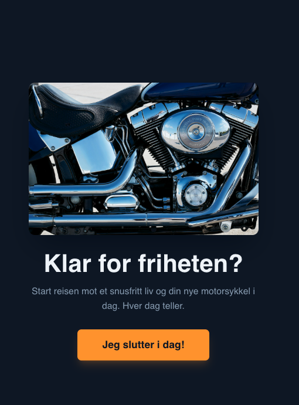
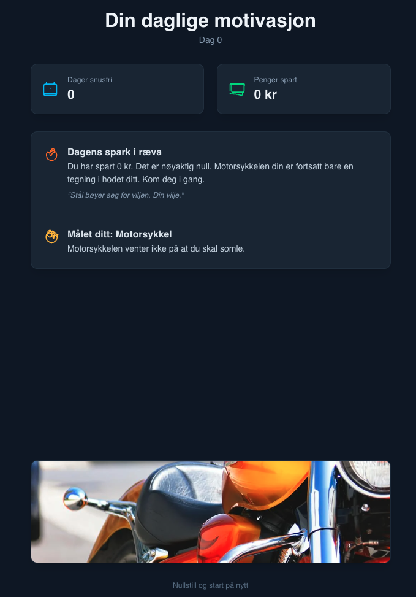

# 🚭 Snusfri Coach

En motiverende app som hjelper deg å holde deg snusfri med fokus på motorsykkelmål. Appen bruker AI for å generere personaliserte motivasjonsmeldinger basert på dine fremskritt.

## 📱 Screenshots

<div align="center">
  
  
</div>

*Dashboard viser dine fremskritt og AI-generert motivasjon | Onboarding hjelper deg å sette mål*

## ✨ Funksjoner

- 📊 **Dashboard** med statistikk over snusfrie dager
- 💰 **Penge-kalkulator** som viser hvor mye du har spart
- 🏍️ **Motorsykkelmål** - visualiser drømmen din
- 🤖 **AI-generert motivasjon** tilpasset dine fremskritt
- 📱 **Responsiv design** som fungerer på alle enheter

## 🚀 Kom i gang

### Forutsetninger
- Node.js (versjon 16 eller nyere)
- En AI API-nøkkel (Google Gemini, OpenAI, etc.)

### Installasjon

1. **Klon repository:**
   ```bash
   git clone https://github.com/barx10/snusfri-coach.git
   cd snusfri-coach
   ```

2. **Installer dependencies:**
   ```bash
   npm install
   ```

3. **Sett opp miljøvariabler:**
   ```bash
   cp .env.example .env
   ```
   Rediger `.env` og legg til din API-nøkkel:
   ```
   API_KEY=din_api_nøkkel_her
   ```

4. **Sett opp AI service:**
   ```bash
   cp services/geminiService.template.ts services/geminiService.ts
   ```
   Rediger `services/geminiService.ts` og implementer din foretrukne AI-tjeneste.

5. **Start utviklingsserver:**
   ```bash
   npm run dev
   ```

6. **Åpne i nettleser:**
   Gå til `http://localhost:5173`

## 🛠️ API Oppsett

Denne appen bruker AI for å generere personaliserte motivasjonsmeldinger. Du kan velge mellom:

- **Google Gemini** (anbefalt)
- **OpenAI GPT**
- **Anthropic Claude**
- **Andre AI-tjenester**

Se `services/geminiService.template.ts` for implementeringsguide.

### Server-side anbefaling (Vercel)

Hvis du deployer på Vercel anbefales det å kjøre AI-kall på serversiden (serverless functions) slik at API-nøkkelen ikke eksponeres i klienten.

1. Legg `GEMINI_API_KEY` (din Gemini/GenAI-nøkkel) inn i Vercel → Project Settings → Environment Variables.
2. Repoet inneholder et eksempel på en Vercel-funksjon: `/api/generate-motivation` som kaller AI-tjenesten fra serveren og returnerer et enkelt `MotivationData` JSON-objekt.
3. Klienten i `services/geminiService.template.ts` er oppdatert for å gjøre et POST-kall mot `/api/generate-motivation` — du kan kopiere den til `services/geminiService.ts` for lokal tilpasning.

Når serverless funker er satt opp, vil frontend aldri eksponere din private nøkkel til brukerne.

### Daglig variasjon og tone

Serverless-endpointet `/api/generate-motivation` er nå designet for å gi flere korte varianter for hver felt (goalReminder, quoteOrFact, brutalMotivation) og returnerer ett element per felt basert på antall dager snusfri. Dette gjør at meldingen varierer fra dag til dag.

Spesielt for `brutalMotivation` blir tonen HÅRD, NÅDELØS og LITT HÅNENDE slik du ba om. `goalReminder` holdes mer motiverende.

Du kan justere hvor mange varianter modellen skal lage i `api/generate-motivation.ts` (vi ber om 5 varianter i standard). Varianten velges deterministisk med `daysFree % n` så samme dag gir samme variant, men det endres hver dag.

Merk: Hvis Vercel ikke har `GEMINI_API_KEY` konfigurert, bruker endpointet en lokal fallback som fortsatt varierer daglig — men *brutalMotivation* i fallback er bevisst hard, nådeløs og litt hånende slik du ba om. Sett `GEMINI_API_KEY` i Vercel for ekte AI-genererte varianter.

## 🏗️ Bygg for produksjon

```bash
npm run build
```

De byggede filene vil være i `dist/` mappen.

## 🤝 Bidra

Bidrag er velkomne! Her er hvordan du kan hjelpe:

1. Fork prosjektet
2. Opprett en feature branch (`git checkout -b feature/AmazingFeature`)
3. Commit endringene dine (`git commit -m 'Add some AmazingFeature'`)
4. Push til branchen (`git push origin feature/AmazingFeature`)
5. Åpne en Pull Request

## 📝 Lisens

Dette prosjektet er lisensiert under MIT License - se [LICENSE](LICENSE) filen for detaljer.

## 🙏 Takk til

- Alle som kjemper mot snusavhengighet
- Motorsykkel-communityet for inspirasjon
- Open source-bidragsyterne

## 📞 Support

Hvis du har spørsmål eller trenger hjelp, oprett en [issue](https://github.com/barx10/snusfri-coach/issues).

---

**Lykke til med reisen mot et snusfritt liv! 🏍️💪**
